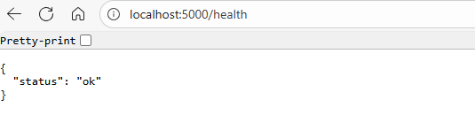
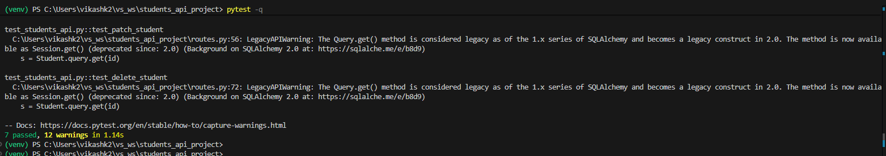
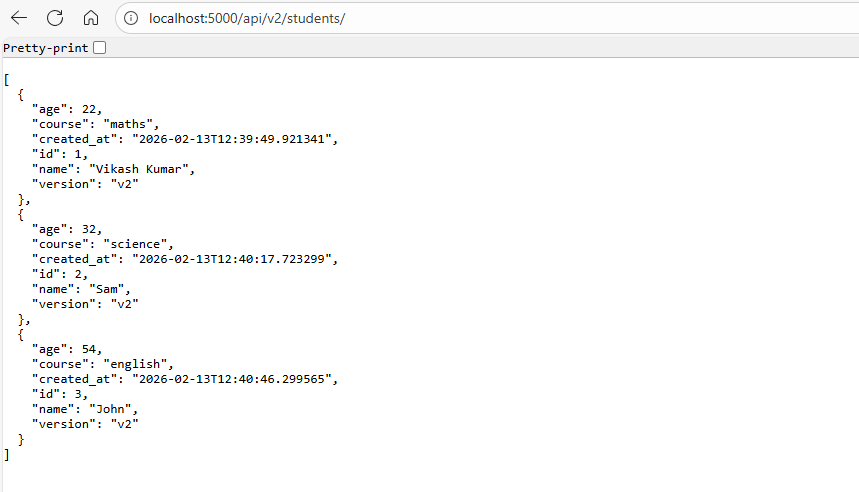
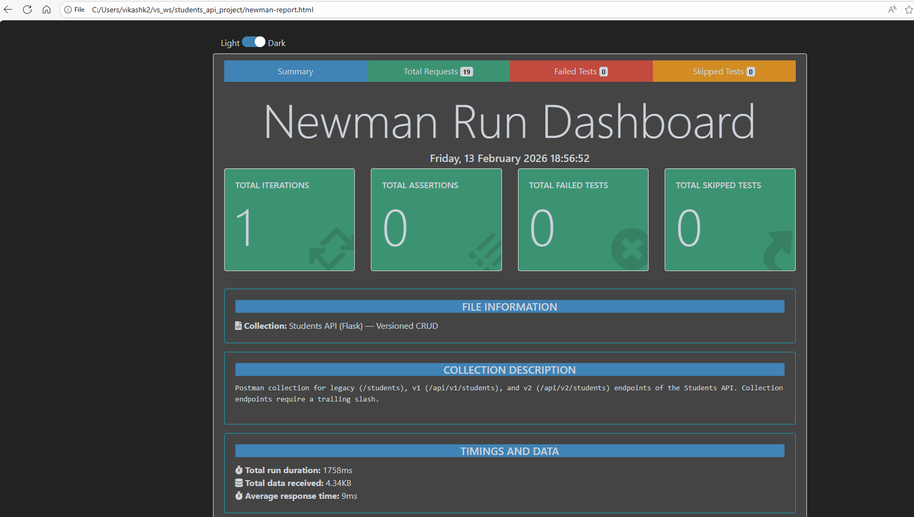

# To view it correct, open README.md file in code view.
-------------------------------------------------------
# REST_API_webserver
Repo contains, a simple REST API webserver where CRUD operation (Create, Read (all, by id), Update (all fields, some fields), and deletion of records performed. Also Health check and versioning of API.
----------------------------------------------------------------------------------------------------

# Start the API
python .\app.py
see: Running on http://127.0.0.1:5000

# Health Check
Invoke-RestMethod http://localhost:5000/health

# Running Tests
----------------------------
# Create venv and install requirements
python -m venv venv                    \
.\venv\Scripts\Activate.ps1            \
pip install -r requirements.txt        \
pytest -q                              \

# Install make in windows
choco install make                     \
make --version        #verify installation/version

# To use Makefile
 make venv         \
 make install      \
 make test         \
 make run          \
 make clean        \

# Base Paths
Legacy (alias to v1): http://localhost:5000/students/             \
v1: http://localhost:5000/api/v1/students/                        \
v2: http://localhost:5000/api/v2/students/                        

# CRUD operation:
1. Create - POST
2. Read - list all - GET
3. Read- get by id - GET
4. update- replace all feilds - PUT
5. Pattial update - modify some feilds - PATCH
6. delete - DELETE

# Data model
{
  "id": 1,
  "name": "John",
  "age": 20,
  "course": "Math",
  "created_at": "2026-02-13T12:34:56.789012"
}                                                 \
v2 response include extra key: "version"          \

# PowerShell (Invoke-RestMethod)
# Create (v1)
$body = @{ name='V1 User'; age=20; course='Math' } | ConvertTo-Json                    \
Invoke-RestMethod -Uri "http://localhost:5000/api/v1/students/" -Method POST -ContentType "application/json" -Body $body

# List (v2)
Invoke-RestMethod -Uri "http://localhost:5000/api/v2/students/" -Method GET

# Patch (legacy → v1)
$patch = @{ age=21 } | ConvertTo-Json                               \
Invoke-RestMethod -Uri "http://localhost:5000/students/1" -Method PATCH -ContentType "application/json" -Body $patch

# PowerShell (curl.exe)
curl.exe -X POST "http://localhost:5000/api/v2/students/" -H "Content-Type: application/json" -d "{\"name\":\"V2\",\"age\":21,\"course\":\"CS\"}"                                                      \
curl.exe "http://localhost:5000/api/v2/students/"                                                    \
curl.exe -X PATCH "http://localhost:5000/api/v2/students/1" -H "Content-Type: application/json" -d "{\"age\":22}"         \
curl.exe -X DELETE "http://localhost:5000/api/v2/students/1"

# To run via POSTMAN
1. Start API server         # App should show: Running on http://127.0.0.1:5000
2. run with NEWMan (CLI)
2.1. install node.js
2.2. install newman globally        npm install -g newman
2.3. Run collection json            newman run .\students_api_postman_collection.json --env-var baseUrl=http://localhost:5000 --env-var studentId=1

# To generate an HTML report
npm install -g newman-reporter-htmlextra

newman run .\students_api_postman_collection.json `
  --env-var baseUrl=http://localhost:5000 `
  --env-var studentId=1 `
  -r htmlextra `
  --reporter-htmlextra-export .\newman-report.html

# how to run Dockerfile
# Check docker is installed or not    docker --version
docker biuild -t rest_api_app:v1    # image_name must be in lowercase

docker images
docker run  -p 5000:5000 rest_api_app:v1

# Multi-stage dockerfile: builder and runner here

# Semantic Versioning(SemVer): Standerd way of assingning version number
# Major.Minor.Patch     (1.4.2)

# How to run docker images with env varable in it.
docker run --rm -p 5000:5000 \
  -e APP_ENV=dev \
  -e LOG_LEVEL=DEBUG \
  -e DB_HOST=10.0.0.12 \
  -e DB_PASS='supersecret' \
  myimage:latest

# use .dockerignore file so you don't accedently copy .env file to image.
#      .dockerignore is file, where we enter all files that need not to be copied to docker images.
# Or you can also create .env file like:
APP_ENV=staging
APP_PORT=5000
LOG_LEVEL=INFO

DB_HOST=db.internal
DB_PORT=5432
DB_USER=report_user
DB_NAME=appdb
DB_PASS=supersecret

docker run --rm -p 5000:5000 --env-file .env myimage:latest     # run this way

# I saved_backuped working SQLite version of REST_API application by:
git init
git add .
git commit -m "Initial working SQLite version"
git tag sqlite-version

Now, to return to this version:
git checkout sqlite-version

